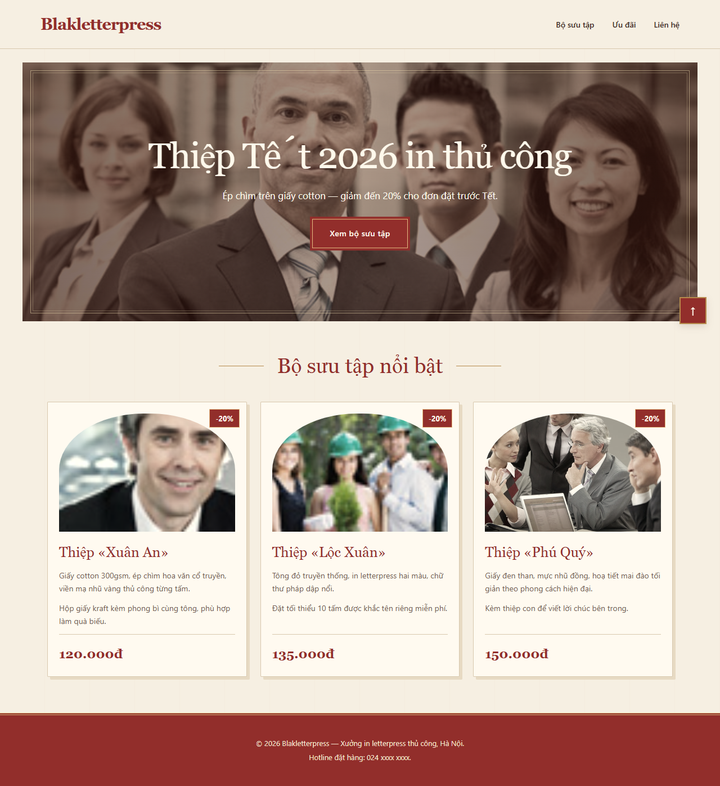
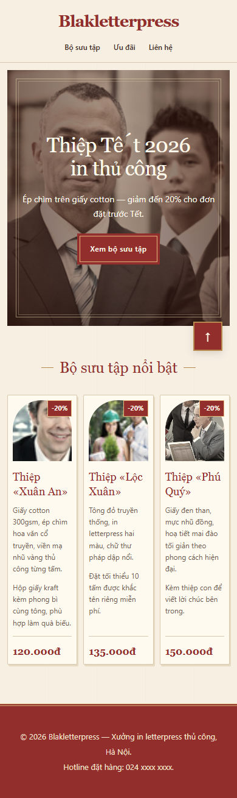
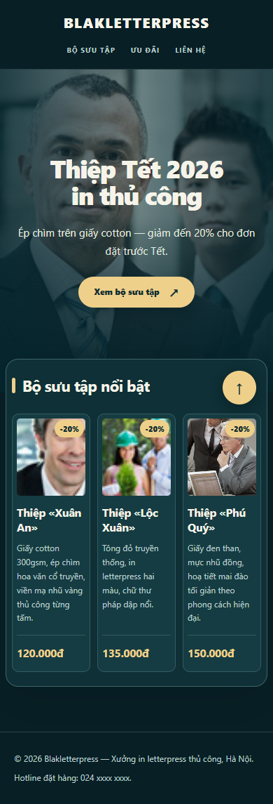

# Hai giao diện riêng cho bài tập CSS

Theo yêu cầu bổ sung, hai bài được thiết kế lại bằng CSS để phân biệt rõ
ngay khi mở trang. HTML, nội dung và 14 ảnh của mỗi bộ nguồn vẫn giữ nguyên
từng byte. Cả hai bản cập nhật đều có AI hỗ trợ.

| Thành phần | Bài 1 — Thiệp Tết giấy kem | Bài 2 — Bộ sưu tập hiện đại |
| --- | --- | --- |
| Bảng màu | Nền kem, đỏ son, đường viền vàng nâu | Nền xanh đậm, chữ sáng, điểm nhấn vàng |
| Typography | Serif ở logo, tiêu đề và giá | Sans-serif đậm, logo và menu in hoa |
| Hero | Nằm trong khung có lề, viền kép, ảnh tông ấm | Tràn ngang màn hình, ảnh phủ màu xanh đậm |
| Khu sản phẩm | Tiêu đề căn giữa, đường trang trí hai bên | Tiêu đề căn trái, nằm trong panel bo góc chồng lên hero |
| Thẻ sản phẩm | Khối giấy vuông, bóng lệch, ảnh đầu vòm | Thẻ xanh bo góc, ảnh chữ nhật bo góc |
| Nhãn giảm giá | Nhãn đỏ hình chữ nhật | Nhãn vàng hình viên thuốc |
| Nút CTA | Đỏ son, viền kép vuông | Vàng, bo tròn, mũi tên chéo |
| Nút lên đầu trang | Vuông đỏ, viền vàng | Tròn vàng |
| Footer | Đỏ son, nội dung căn giữa | Xanh đậm, nội dung chia hai phía trên desktop |

## Link và mã nguồn hiện tại

- [Bài tập 1](http://www.dunglq09.id.vn/css-bai-tap/bai-1/trang.html) · [ZIP Bài 1](bai-1-da-sua.zip).
- [Bài tập 2](http://www.dunglq09.id.vn/css-bai-tap/bai-2/trang.html) · [ZIP Bài 2](bai-2-da-sua.zip).
- CSS riêng: [Bài 1](bai-1/style-loi.css), [Bài 2](bai-2/style-loi.css).

## Yêu cầu chức năng vẫn được bảo đảm

- Header sticky với `top: 0; z-index: 100`, luôn nằm trên hero khi cuộn.
- Hero có mốc `position: relative`; ảnh `object-fit: cover`; khối tiêu đề
  vẫn ở chính giữa ảnh với `translate(-50%, -50%)`.
- Ba card cùng một hàng, dùng `border-box`, `min-width: 0` và cho phép chữ
  xuống dòng. Card tăng chiều cao theo nội dung; giá căn về cuối thẻ.
- Mỗi badge định vị theo card riêng, nằm trên ảnh. Insets là 12px trên
  desktop và 8px trên màn hình nhỏ.
- Nút `↑` fixed, cách đáy và mép phải viewport 24px; nhấn đưa về đầu trang.
- Bài 2 tiếp tục dùng `.page { overflow-x: clip; }`, giữ hiệu ứng ảnh
  `scale(1.08)`, vị trí sản phẩm chồng lên hero 48px và đúng thứ tự lớp.
- Trên màn hình nhỏ, giảm padding, khoảng cách và cỡ chữ để ba cột dễ đọc
  hơn. Không giấu chữ hoặc ảnh để xử lý tràn khung.

## Kiểm thử bản thiết kế mới

Kiểm tra bằng Chrome 154.0.8037.58 ở viewport cao 600px, rộng 1280, 1024,
900, 768, 390 và 320px. Mỗi trang đều đạt kiểm tra ba card cùng hàng,
ảnh/chữ trong card, badge trên ảnh, hero phủ kín, tiêu đề chính giữa,
header sticky và nút fixed sau khi cuộn 150px, 250px và tới cuối trang.
Không có tràn ngang, lỗi tải tài nguyên hoặc lỗi JavaScript.

| Viewport | Rộng card Bài 1 (px) | Rộng card Bài 2 (px) | Kiểm tra chức năng |
| --- | ---: | ---: | --- |
| 1280 | 354,66 | 348,66 | Cả hai đạt |
| 1024 | 309,33 | 287,33 | Cả hai đạt |
| 900 | 267,98 | 245,98 | Cả hai đạt |
| 768 | 223,98 | 201,98 | Cả hai đạt |
| 390 | 115,33 | 111,98 | Cả hai đạt |
| 320 | 92,00 | 88,66 | Cả hai đạt |

SHA-256 của HTML giữ nguyên:

```text
Bài 1: f084148e5d0b9ea79471a49762419bf716098706fa9a0b67388c6da815864676
Bài 2: 36ad279a998f3a17076f8b6da511375982cdbad33abd3ab31d2df01e32de502f
```

Ảnh giao diện hiện tại:

| Bài 1 | Bài 2 |
| --- | --- |
|  |  |
|  |  |

## Quan hệ với báo cáo chẩn đoán ban đầu

[Báo cáo Bài 1](BAO_CAO_BAI_1.md) và [Báo cáo Bài 2](BAO_CAO_BAI_2.md)
giữ phần phân tích lỗi của nguồn gốc và minh chứng bản sửa lỗi ban đầu.
Số đo, màu sắc và ảnh chụp trong các phần đó thuộc phiên bản trước thiết kế
lại; tài liệu này mô tả phiên bản đang triển khai. Hai ZIP đã được cập nhật
theo CSS mới. Liên kết HTML gốc `#uu-dai` vẫn chưa có đích, vì không sửa HTML.
